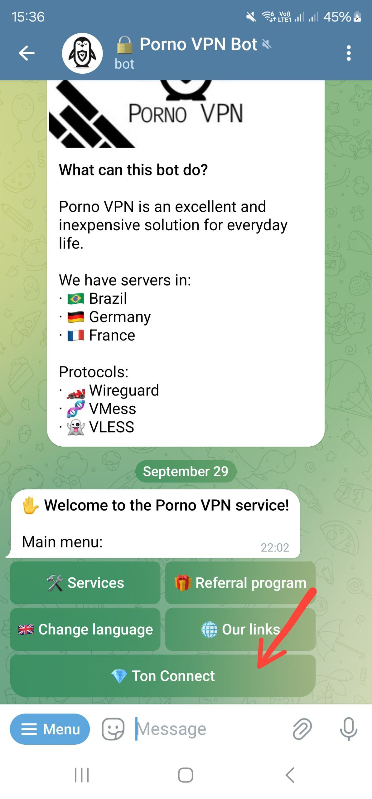

# Ton Connect

## Connect wallet 

Go to the TON Connect menu first.

<figure><picture><source srcset="../.gitbook/assets/image (1).png" media="(prefers-color-scheme: dark)"></picture><figcaption></figcaption></figure>

Then, click the "🔗 Connect Wallet" button.

<figure><picture><source srcset="../.gitbook/assets/image (3).png" media="(prefers-color-scheme: dark)"></picture><figcaption></figcaption></figure>

To continue, you will need to select the wallet app you are using.

<figure><picture><source srcset="../.gitbook/assets/image (5).png" media="(prefers-color-scheme: dark)"></picture><figcaption></figcaption></figure>

Now press the button bellow.

<figure><picture><source srcset="../.gitbook/assets/image (7).png" media="(prefers-color-scheme: dark)"></picture><figcaption></figcaption></figure>

After successful connect, you will be redirected back to the telegram bot. Here you will see your linked wallet address.

<figure><picture><source srcset="../.gitbook/assets/image (9).png" media="(prefers-color-scheme: dark)"></picture><figcaption></figcaption></figure>

## Unlink and disconnect

With connected wallet you can see a two options in the Ton Connect menu.

<figure><picture><source srcset="../.gitbook/assets/image (11).png" media="(prefers-color-scheme: dark)"></picture><figcaption></figcaption></figure>

**Unlink Wallet** will remove your wallet from the current profile, allowing you to connect a different one.

**Disconnect Wallet** will disconnect you from the current profile. You can still regain access by reconnecting your wallet to the bot. If you've purchased a subscription, slots, keys, or have referrals, they will be merged with the profile that was previously linked to the wallet.


You can use your VPN profile from only one Telegram account at a time!

